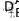

# Modified Nodal Analysis

Before starting to build custom components, it is first important to discuss how the simulator solves the node voltages of a circuit. This is done using a modified nodal analysis.

## Nodal Analysis

Regular *nodal analysis* works by describing Kirchoff's Current Laws (KCL) in each and every node of the circuit. Let's take a look at the following circuit.

This circuit contains two types of elements:

- *Current sources* do not care about the voltage across them and will always drive the specified current.
- *Resistors* obey Ohm's law, such that:

</a>

*Kirchoff's Current Law* states that the *sum* of all *currents* in every *node* has to equal *zero*. In this circuit, we have 3 nodes, and so we get a system of 3 equations:

</a>

This can conveniently be written in matrix formulation as well:

</a>

The 3x3 matrix on the left is called the *admittance matrix*, while the vector on the right is the current vector. Pretty much *all* circuit simulation software will formulate a problem in terms of a *matrix* and a *vector*, for which the simulator will then solve .

## Modified Nodal Analysis

What happens if we introduce a *voltage source* into the circuit?

We can't use the KCL equation now, because it is in the nature of a voltage source to *not care* about currents! This is where we get creative. We define a new unknown variable, the current through the voltage source . We also add the equation of the voltage source to the system of equations:

And what we find is the useful result: we can combine it all using a matrix and vector again!

We notice the following properties:
- We added an unknown *current*. For *regular* Nodal Analysis, the unknowns are *always a voltage*.
- The circuit got *larger* because we added a voltage source. While this may not be desirable when working it out by hand, a simulator will rarely feel the difference.
- Each component of the circuit has its own unique contribution to the admittance matrix and current vector. This is a direct consequence of KCL that says that the **sum** of currents needs to total to 0. In fact, the resistors only affect the elements to which they are connected to - ie. the nodes where they add or subtract current. For example, the 5 ohm resistor only affects the rows and columns of  and . This turns out to be an important general property! A Spice simulator will give the matrix and vector to each component, and the component will *stamp* the matrix and vector with contributions that depend *only* on that component!

## Nonlinear components

The electronics world is littered with so-called nonlinear components. These are components where the currents and voltages do not relate *linearly*, but are often connected in complex ways.

A resistor is a *linear* component, because the current and voltage are connected via Ohm's law: . However, a diode is a *non-linear* component, because the diode current depends on the diode voltage following the equation ).

In order to solve a circuit with nonlinear components, we have to resort to *iterative* algorithms. Spice-based simulators almost exclusively use the **Newton-Raphson** algorithm. This algorithm tries to solve, generally speaking, the following problem:

For this problem, the functions  do *not* have to be linear! The algorithm then shows that, starting from an initial vector , a *new* vector,  can be approximated that is *closer* to the real solution. The new solution  can be found by solving the following set of equations.

Where  is called the *Jacobian*, which is

We can repeat the process using }) as a starting solution, to get even *closer* to the real position. As we repeat this algorithm, the solution will *converge* to the real solution. Once our solution is almost indistinguishably close to the real solution, we accept it as our final solution.

One more thing to note is that Spice will modify the algorithm a tiny bit.

The *Jacobian* is from here on out called the *Y-matrix*. Everything on the right of the equation is called the *Right-Hand Side vector* (RHS vector). This formulation allows us to immediately calculate the *next* solution rather than the increment to find the next solution.

## How Spice# does it

Spice# will give each behavior the chance to:
- allocate elements in the Y-matrix and RHS-vector during binding (in the method *[Bind](xref:SpiceSharp.Behaviors.IBehavior.Bind(SpiceSharp.Simulations.Simulation,SpiceSharp.Behaviors.BindingContext))*). To optimize performance and memory, the behavior should try not allocate more elements than needed.
- add contributions to the allocated elements when computing a new iteration. This is called *loading* the Y-matrix and RHS-vector. After all components have loaded the matrix and vector, the simulator will solve the system of equations to find the solution for this iteration.

### Example: Resistors

As discussed in the first section, a resistor follows Ohm's law. Let us assume that the resistor is connected between two nodes A and B.

Then Ohm's law dictates that

The resistor current  will flow *out* of node A, and *into* node B, so we have contributions to row A and row B:

Now we can compute the contributions to the *Y-matrix*:

All other *Y-matrix* contributions are 0. Similarly, we calculate the contributions to the *RHS vector*:

The first and second terms for the RHS vector cancel each other out. This turns out to be a *general property of linear components*. Another consequence is that a step of the iterative method is identical to regular Nodal Analysis, and we only need *one* iteration to find the right solution *if we only have linear components*. Once a nonlinear component is introduced, a single iteration will not be sufficient anymore.

To summarize:
- During binding, the *Resistor* biasing behavior will allocate 4 matrix elements: . It does not need RHS vector elements because they are always 0.
- During execution, the *Resistor* biasing behavior will add values to the following elements:

  

- The simulator will give all other components in the circuit a chance to load the matrix with its contributions.

### Example: Diodes

A diode is an example of a *nonlinear* component. When connected between two nodes A and B, we can use the [Shockley diode model](https://en.wikipedia.org/wiki/Diode_modelling) to model the voltage-current relationship.

The diode current flows *out* of node A, and *into* node B, so we have contributions to *two* current equations.

From this we can calculate the contributions to the *Y-matrix*. Since the current equation contributions only depend on nodes A and B, we only get contributions to four elements.

We then calculate the contributions to the *RHS-vector*:

We note that this time the *RHS-vector* contributions are *not* 0 for the current equations. This is again typical for *nonlinear* components. The solution will need to be found in multiple iterations.

[Previous: Custom Models](custom_models.md)
 
[Next: Base Behaviors](base_behaviors.md)

