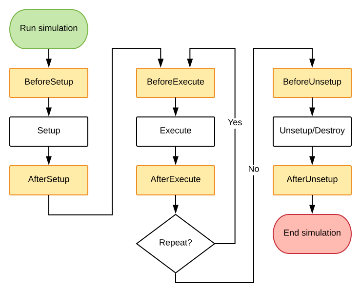

# Spice# Flow

The main structure of Spice# revolves around **entities**, **behaviors**, **simulations** and their **simulation states**.

<p align="center"></p>

When running a simulation, that simulation will create the necessary simulation states, and ask for each entity in the entity collection to create behaviors for the simulation (the entity can add its behaviors to the simulation's **[IEntityBehaviorCollection](xref:SpiceSharp.Behaviors.IBehaviorContainerCollection)**). These behaviors define methods that can be called by the simulation when needed.

Behaviors implement specific parts of the simulation algorithm and are also specific to the **entity** being modeled. For example, a **[Transient](xref:SpiceSharp.Simulations.Transient)** simulation requires several types of behaviors that a component might need to implement. The behaviors would then implement one or more of these interfaces:

- An **[ITemperatureBehavior](xref:SpiceSharp.Behaviors.ITemperatureBehavior)** that describes a method that tells the behavior that the temperature might have changed. The entity should recalculate anything that might have changed.
- An **[IBiasingBehavior](xref:SpiceSharp.Behaviors.IBiasingBehavior)** that contains methods that are called each iteration in order to build up the Y-matrix and right-hand side vector.
- An **[IConvergenceBehavior](xref:SpiceSharp.Behaviors.IConvergenceBehavior)** that allows some influence over deciding whether or not a new iteration should be computed.
- An **[ITimeBehavior](xref:SpiceSharp.Behaviors.ITimeBehavior)** that gets called when it's okay to make time-dependent states that can be integrated.

Once all **behaviors** have been created by all **entities**, the simulation no longer has a need for entities, and will continue to work with just the created behaviors.

# Entities

An entity implements the **[IEntity](xref:SpiceSharp.Entities.IEntity)** interface. The main job of the entity is to create behaviors for simulations, at which point they are allowed to search for other entities that they are linked to (like a mutual inductance that searches for its inductors, or a component/instance that searches for its model). Each entity also has a **name** and can contain **parameters**.

In all Spice-based simulators the distinction is made between *instances* and *models*. Both are considered **entities** in Spice#, however the *instance* entity will ask the simulation for the behaviors created by the *model* entity, by using the model entity's name. This prompts the simulation to first ask the *model* entity for behaviors. An *instance* entity in Spice# has been implemented through the **[IComponent](xref:SpiceSharp.Components.IComponent)** interface.

## Parameters and properties

Entities can contain one or more **[IParameterSet](xref:SpiceSharp.ParameterSets.IParameterSet)**'s that can be used by behaviors. They are usually simple classes with properties that contain information that needs to be passed down to the behaviors, like the resistance of a resistor or DC voltage of a voltage source, but they can just as well be used to describe anything. These parameters can be set directly by accessing the entity's members or, when implemented, they can also be set using their Spice "name". The name of a parameter is nothing more than a shorthand notation used by most Spice simulators to identify the parameter.

For example, the parameters of a resistor are defined in @SpiceSharp.Components.Resistors.Parameters.

| Property name      | Names               | Description                                      | Remarks                                                          |
| :----------------- | :------------------ | :----------------------------------------------- | :--------------------------------------------------------------- |
| `Resistance`         | `resistance` or `r` | Resistance (ohms)                                | If not specified, the model is used to determine the resistance. |
| `TemperatureCelsius` | `temp`              | Instance operating temperature (degrees Celsius) |                                                                  |
| `Width`              | `w`                 | Width (m)                                        | Optional parameter that is only used if a model is specified.    |
| `Length`             | `l`                 | Length (m)                                       | Optional parameter that is only used if a model is specified.    |
| `ParallelMultiplier` | `m`                 | Number of resistors in parallel                  |                                                                  |
| `SeriesMultiplier`   | `n`                 | Number of resistors in series                    |                                                                  |

It is possible to set the resistance of the resistor simply by using any of the following methods:

```csharp
// Set resistance straight from the constructor to 1kOhm
var resistor = new Resistor("R1", "a", "b", 1e3);

// Set resistance using the property directly to 2kOhm
resistor.Parameters.Resistance = 2.0e3;

// Set resistance using the name of the parameter using its Spice name
// Note: if you use 3e3 instead of 3.0e3, then this method will try to find
// a parameter of type "int" so make sure to specify a double!
resistor.Parameters.SetParameter("r", 3.0e3);
```

## Entity collections

Entities can be grouped into collections using **[IEntityCollection](xref:SpiceSharp.Entities.IEntityCollection)**. The name of each entity should be uniquely defined within that collection. The most used implementation of such a collection is **[Circuit](xref:SpiceSharp.Circuit)**.

# Simulations

Simulations will manipulate behaviors in a way that is useful for modeling reality, like doing a transient simulation. In order for behaviors to work together, they can all gain access to shared **simulation states**. A simulation state can contain the current iteration solution's node voltages and branch currents for biasing simulations, but just as well the noise quantities for noise simulations, or the integration method used by a transient simulation.

## Behaviors

Once behaviors are created, they should be self-sufficient. This means that any properties that you wish to be able to retrieve (even those defined in the entity) will need to be referenced or redefined in the behavior.

## Simulation states

Simulation states are usually just classes that are only exposed through some interface that implements **[ISimulationState](xref:SpiceSharp.Simulations.ISimulationState)**. They can come in many forms, but the most common one will probably be the **[IBiasingSimulationState](xref:SpiceSharp.Simulations.IBiasingSimulationState)**. This simulation state contains the Y-matrix and right-hand side vector needed to iterate to a solution of the whole circuit.

Code in behaviors should be written in a way that is compatible with the simulation. Unforunately this takes some knowledge, but to help you along you can follow the section about custom components.