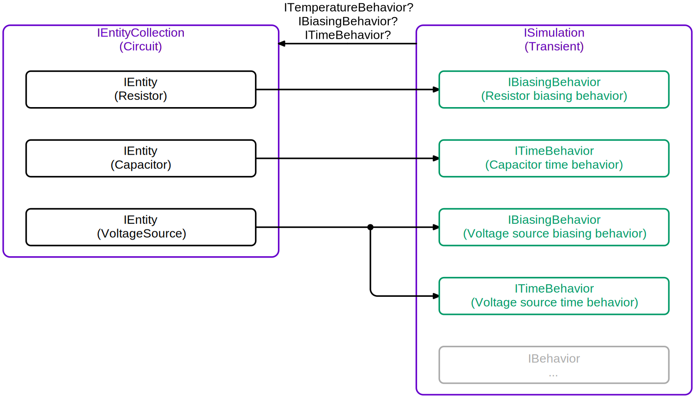

# Spice# Flow

The main structure of Spice# revolves around **entities**, **behaviors** and **simulations**. A **simulation** will implement algorithms that use one or more **behaviors**. These behaviors implement specific parts of the algorithm and is specific to the **entity**. For example, a **[Transient](xref:SpiceSharp.Simulations.Transient)** simulation requires several types of behaviors that a component might want to implement:

- An **[ITemperatureBehavior](xref:SpiceSharp.Behaviors.ITemperatureBehavior)** that describes a method that tells the behavior that the temperature might have changed. The entity should recalculate anything that might have changed.
- An **[IBiasingBehavior](xref:SpiceSharp.Behaviors.IBiasingBehavior)** that contains methods that are called each iteration in order to build up the Y-matrix and right-hand side vector.
- An **[IConvergenceBehavior](xref:SpiceSharp.Behaviors.IConvergenceBehavior)** that allows some influence over deciding whether or not a new iteration should be computed.
- An **[ITimeBehavior](xref:SpiceSharp.Behaviors.ITimeBehavior)** that gets called when it's okay to make time-dependent states that can be integrated.

The simulation will ask each **entity** for these behavior types, and the **entity** will create **behaviors** that implement these interfaces. None of these interfaces are *required*. For example, the resistor that only implements an **[IBiasingBehavior](xref:SpiceSharp.Behaviors.IBiasingBehavior)** will work just fine even if it doesn't provide the simulation with any other simulation.

Once all **behaviors** have been created by the **entities**, the simulation no longer needs any entity, and it will continue to work only with the behaviors.

<p align="center"></p>

# Entities

The main job of entities is create the behaviors for simulations that request them, however they are also in charge of finding any other entities that might be needed first. Each entity is required to have a **name**.

For example, a **model** entity is shared by multiple entities, and it can contain logic that only has to be executed once for all of them. The **component** entities can ask the simulation for the model behaviors before creating their own behaviors. The simulation will make sure that the model is created first.

## Parameters and properties

Entities contain one or more **[IParameterSet](xref:SpiceSharp.Parameters.IParameterSet)** instances that used by the created behaviors once the simulation asks for them. These parameters can be set directly by accessing the entity's properties, or they can also be set by their *name*. The *name* of a parameter is nothing more than a shorthand notation that is used by Spice simulators to identify the parameter.

For example, the parameters of a resistor are defined in @SpiceSharp.Components.Resistors.Parameters.

| Property name | Names | Description |
|:--------------|:------|:------------|
| Resistance | "resistance" or "r" | Resistance (ohms) |
| TemperatureCelsius | "temp" | Instance operating temperature (degrees Celsius) |
| Width | "w" | Width (m) |
| Length | "l" | Length (m) |
| ParallelMultiplier | "m" | Number of resistors in parallel |
| SeriesMultiplier | "n" | Number of resistors in series |

It is possible to set the resistance of the resistor simply by using any of the following methods:

```
// Set resistance straight from the constructor to 1kOhm
var resistor = new Resistor("R1", "a", "b", 1e3);

// Set resistance using the property directly to 2kOhm
resistor.Parameters.Resistance = 2.0e3;

// Set resistance using the name of the parameter using reflection to 3kOhm
// Note: if you use 3e3 instead of 3.0e3, then this method will try to find
// a parameter of type "int" so make sure to specify a double!
resistor.Parameters.SetParameter("r", 3.0e3);
```

## Entity collections

Entities can be grouped into collections using **[IEntityCollection](xref:SpiceSharp.Entities.IEntityCollection)**. The name of each entity should be uniquely defined within that collection. The most used implementation of such a collection is **[Circuit](xref:SpiceSharp.Circuit)**.

# Simulations

Simulations will manipulate behaviors in a way that is useful for modeling reality, like doing a transient simulation. In order for behaviors to work together, they will access shared **simulation states**. A simulation state can contain the current iteration solution's node voltages and branch currents for biasing simulations, but just as well the noise quantities for noise simulations, or the integration method used by a transient simulation.

## Behaviors

Once behaviors are created, they should be self-sufficient. This means that any properties that you wish to be able to retrieve (even those defined in the entity) will need to be referenced or redefined in the behavior.

## States

Simulation states come in many forms, but the most common one will be the **[IBiasingSimulationState](xref:SpiceSharp.Simulations.IBiasingSimulationState)**. This simulation state contains the Y-matrix and right-hand side vector needed to iterate to a solution of the whole circuit.
