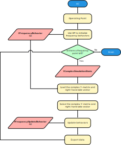

# AC / Small Signal analysis

A small signal or AC analysis assumes that a signal amplitude is so small that the circuit can be assumed to behave **linearly**. It starts out by calculating the **[Operating point](operatingpoint.md)** and then linearizing the circuit. It then calculates the complex output.

## Frequently encountered issues

### All voltage and/or current solutions are 0

There might not be an independent source with a specified AC magnitude and/or phase. Possible reasons for this include:

- The DC value is specified, but not the AC amplitude.
- The independent source is not connected.