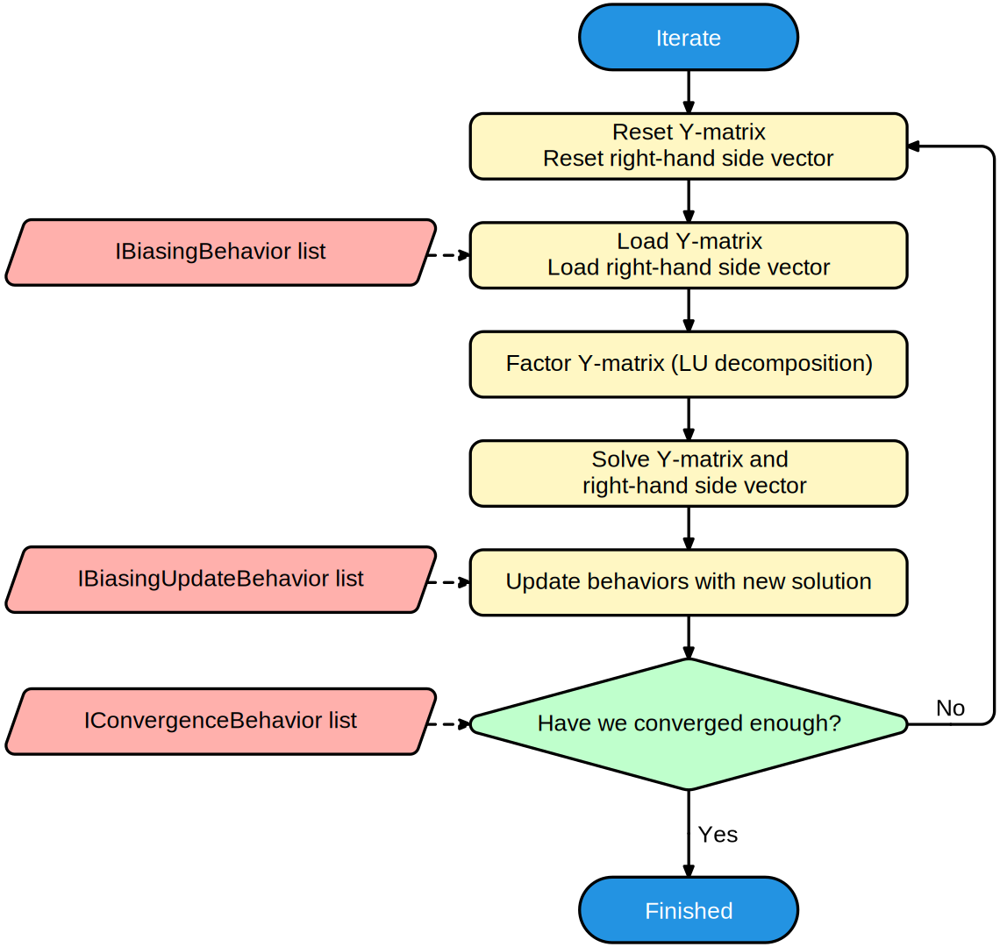

# Iterating to a solution

Iterating to a solution is the core of any simulation. A flow chart of what happens when iterating is shown here:

Iterations are kept track of via the **[IBiasingSimulationState](xref:SpiceSharp.Simulations.IBiasingSimulationState)**. Each **[IBiasingBehavior](xref:SpiceSharp.Behaviors.IBiasingBehavior)** gets the chance to manipulate the Y-matrix and right-hand side vector, after which a solution is found.

Once the solution does not change significantly (if the error is within tolerances), then the method stops iterating.