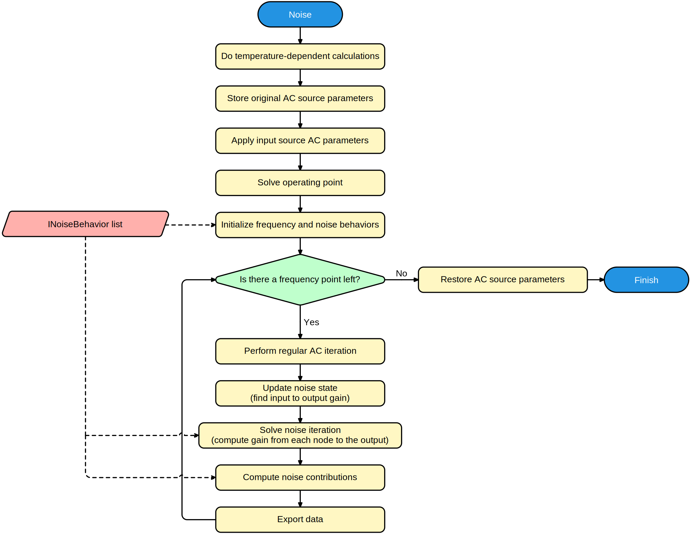

# Noise analysis

A noise analysis is an extension on an [AC analysis](frequency.md), where noise sources can be modeled, and each of their contributions can be evaluated and combined in a total input and output noise.

