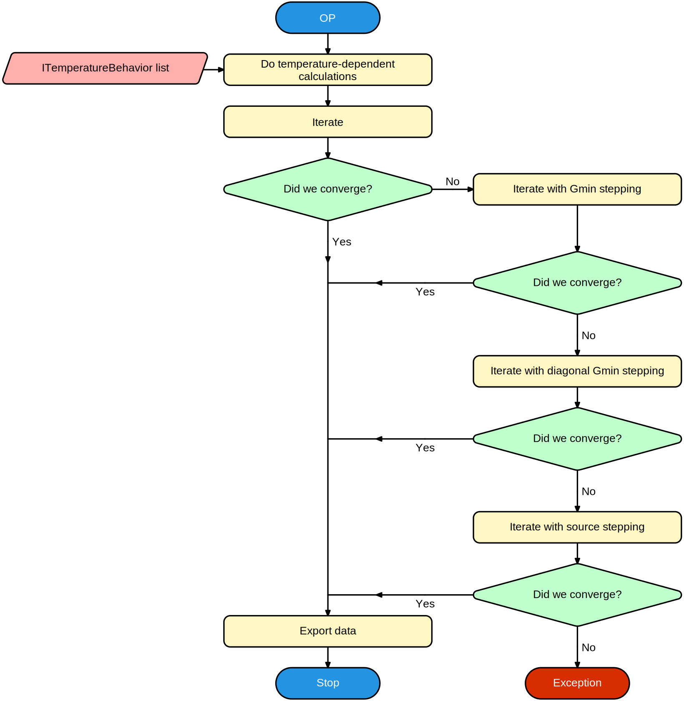

# DC / Operating point analysis

## Operating point calculations

The operating point of a circuit is the static solution to a a circuit, ie. all voltages and currents are assumed to be constant over time.

Calculating the operating point is often the first step in any simulation. First the temperature-dependent properties are calculated. Then the analysis will **[iterate](iterate.md)** to find a solution. Iterative solutions do not always guarantee convergence, so multiple schemes are provided to help convergence if the first attempt fails.

## Gmin stepping

A common issue for convergence is exponential dependencies of a current on a voltage or vice-versa, like is often the case in diode-type structures (PN-junctions). The problem occurs because on one side of the exponential the curve is very horizontal, while on the other side it is almost vertical. This causes iterations to either over-step, or under-step when the current solution is too far from the real solution. By placing an additional resistive path in parallel to these problematic areas this issue can be alleviated. Usually a high **Gmin** allows the circuit to converge pretty quickly to a solution that is closer to the actual solution. This new solution can be used to iterate again with progressively smaller **Gmin** as the solution gets closer and closer to the actual solution.

## Diagonal Gmin stepping

Diagonal Gmin stepping is almost identical to Gmin stepping, except that it will add a resistor to **ground** from each node in the circuit, not just for exponential curves. This translates to adding **Gmin** to each diagonal element of a voltage node in the Y-matrix - hence the name.

## Source stepping

For source stepping, all independent sources are given a value of 0 volts or 0 amps. The solution should at that point be trivial (all voltages and currents will be very close to 0). By slowly ramping up all independent sources again, a solution can be found where the solution does not change as much from one step to the next.

# DC analysis

A DC analysis is nothing more than a sequence of operating point analysis where one or more parameters are being swept.

Temperature-dependent calculations are executed only once at the start of the sweep.