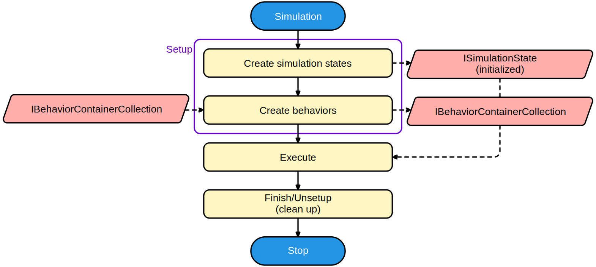

# Structure

In this section we will discuss the basic structure of any simulation that is run. We discuss

- The data structure of Spice#.
- How any **[Simulation](xref:SpiceSharp.Simulations.Simulation)** uses a **[Circuit](xref:SpiceSharp.Circuit)** object to run a simulation.
- How any **[Simulation](xref:SpiceSharp.Simulations.Simulation)** runs an analysis.

## Circuit description

The main container for storing your circuit elements will be the **[Circuit](xref:SpiceSharp.Circuit)** class. It contains one or more **[Entity](xref:SpiceSharp.Circuits.Entity)** objects which can be referenced by a unique name. Each **[Entity](xref:SpiceSharp.Circuits.Entity)** can contain parameters that can be accessed through the *[ParameterSets](xref:SpiceSharp.Circuits.Entity.ParameterSets)* property. This is a collection of classes (all implementing **[ParameterSet](xref:SpiceSharp.ParameterSet)**) that can be searched by type. This allows logically separating parameters based on their context.

For example, a **[Resistor](xref:SpiceSharp.Components.Resistor)** will typically contain one set of parameters, namely an object of the class  **[SpiceSharp.Components.ResistorBehaviors.BaseParameters](xref:SpiceSharp.Components.ResistorBehaviors.BaseParameters)**. This parameter set contains - amongst others - the *[Resistance](xref:SpiceSharp.Components.ResistorBehaviors.BaseParameters.Resistance)* of type **[GivenParameter](xref:SpiceSharp.GivenParameter`1)** of the resistor. So we can change the resistance value of our resistor by writing:

[!code-csharp[Resistor](../../SpiceSharpTest/BasicExampleTests.cs#example_structure_resistor)]

Alternatively, we can see that the *[Resistance](xref:SpiceSharp.Components.ResistorBehaviors.BaseParameters.Resistance)* property is tagged with a **[ParameterNameAttribute](xref:SpiceSharp.Attributes.ParameterNameAttribute)** that gives the property the name "resistance", and a **[ParameterInfoAttribute](xref:SpiceSharp.Attributes.ParameterInfoAttribute)** that indicates that the property is a *principal* parameter. These two attributes allow us to edit the same property in other ways.

[!code-csharp[Resistor 2](../../SpiceSharpTest/BasicExampleTests.cs#example_structure_resistor_2)]

Depending on the situation, parameter sets can be added for different types of simulations or situations. Also note that the *[SetParameter](xref:SpiceSharp.Circuits.Entity.SetParameter(System.String,System.Collections.Generic.IEqualityComparer{System.String}))* method can be chained to easily specify multiple parameters on an entity.

## Simulation description

Simulations can be set up in a similar fashion. They also contain a configurations with the same type of parameter sets in the property  *[Configurations](xref:SpiceSharp.Simulations.Simulation.Configurations)*. For example, a **[DC](xref:SpiceSharp.Simulations.DC)** simulation will use a **[DCConfiguration](xref:SpiceSharp.Simulations.DCConfiguration)** to determine the sweeps of the analysis. These can be accessed using the following code:

[!code-csharp[DC example](../../SpiceSharpTest/BasicExampleTests.cs#example_structure_dc)]

The **[DC](xref:SpiceSharp.Simulations.DC)** class also implements **[BaseSimulation](xref:SpiceSharp.Simulations.BaseSimulation)** which also means it uses a **[BaseConfiguration](xref:SpiceSharp.Simulations.BaseConfiguration)** to have access to for example the tolerance on accepted solutions.

[!code-csharp[DC example 2](../../SpiceSharpTest/BasicExampleTests.cs#example_structure_dc_2)]

## Running simulations

All simulations implement the **[Simulation](xref:SpiceSharp.Simulations.Simulation)** class. Executing an analysis can be summarized in the following flowchart.

The processes in yellow indicate events for which you can register to control the flow of the simulation.

### Setup

When a simulation sets up, it will ask each entity in the circuit to create *behaviors*. It gives a list of interfaces that the simulation will use to the entity (in order of potential appearance, eg. a **[ITemperatureBehavior](xref:SpiceSharp.Behaviors.ITemperatureBehavior)** always precedes the **[IBiasingBehavior](xref:SpiceSharp.Behaviors.IBiasingBehavior)** because it is used earlier by the simulation), and the entity returns a number of behaviors that implement these interfaces. If none of the behaviors implement an interface, then it is not returned and it is silently ignored. Do *avoid* the situation where multiple behavior objects implement the same behavior interface, as only one of them will be recognized by the simulation.

A typical class structure for entity behaviors can look as follows:
- We implement a **TemperatureBehavior** that implements the **[ITemperatureBehavior](xref:SpiceSharp.Behaviors.ITemperatureBehavior)** interface.
- We create a new class **BiasingBehavior** that extends **TemperatureBehavior**, and also additionally implements **[IBiasingBehavior](xref:SpiceSharp.Behaviors.IBiasingBehavior)**.
- We also implement the **[ITimeBehavior](xref:SpiceSharp.Behaviors.ITimeBehavior)** in the **TimeBehavior** class that extends **BiasingBehavior**.
- In order to support small-signal analysis, we don't need time behaviors, but we do need the **BiasingBehavior** to find the operating point. So we create a **FrequencyBehavior** that extends **BiasingBehavior**, and implements the **[IFrequencyBehavior](xref:SpiceSharp.Behaviors.IFrequencyBehavior)**.
- Finally, we implement the **NoiseBehavior** class by extending the **FrequencyBehavior** and implementing the **[INoiseBehavior](xref:SpiceSharp.Behaviors.INoiseBehavior)**.

An **[AC](xref:SpiceSharp.Simulations.AC)** simulation needs the behaviors (in order): **[ITemperatureBehavior](xref:SpiceSharp.Behaviors.ITemperatureBehavior)**, **[IBiasingBehavior](xref:SpiceSharp.Behaviors.IBiasingBehavior)**, **[IFrequencyBehavior](xref:SpiceSharp.Behaviors.IFrequencyBehavior)**. When the simulation asks the entity with the above behavior class structure for these behavior types, the entity will first try to find a behavior that implements **[IFrequencyBehavior](xref:SpiceSharp.Behaviors.IFrequencyBehavior)** and creates an instance of that type. It then continues to search for a **[IBiasingBehavior](xref:SpiceSharp.Behaviors.IBiasingBehavior)** but it will quickly detect that it already created a behavior that implements it, so it will not need to create a new instance. The situation is identical for the **[ITemperatureBehavior](xref:SpiceSharp.Behaviors.ITemperatureBehavior)**. While the analysis asked for three behavior types, our entity only returns one behavior, and that behavior implements all interfaces.

The simulation will also store references to the parameter sets of each entity in the circuit. It is possible to *clone* parameter sets, rather than referencing them, to allow multiple simulations to be run in parallel. To enable this feature, set the flag **[CloneParameters](xref:SpiceSharp.Simulations.CollectionConfiguration.CloneParameters)** in the **[CloneConfiguration](xref:SpiceSharp.Simulations.CollectionConfiguration)** configuration class of the simulation.

Each behavior is bound to the simulation and default parameters are calculated for each parameter set (eg. parameters that are derived from other parameters if they are not set by the user).

### Execute

Execution of the simulation is entirely dependent on the type of simulation. After the simulation execution has finished, you have the option to *repeat* the simulation. This is by subscribing to the *[AfterExecute](xref:SpiceSharp.Simulations.Simulation.AfterExecute)* event, and changing the argument property *[Repeat](xref:SpiceSharp.Simulations.AfterExecuteEventArgs.Repeat)*.

### Unsetup/Destroy

In this phase the simulation will remove references of all the data previously allocated during setup. This allows the garbage collector to clean up resources.

[Previous: Transient analysis](../tutorial/transientanalysis.md)
 
[Next: Entities, components and models](entities.md)

