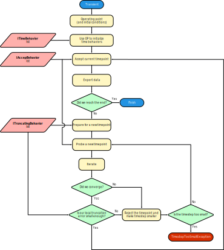

# Transient analysis

A transient analysis a pretty complex type of simulation that tries to model all effects in time. It does so by *discretizing* the timepoints. Like many other simulations, it starts out by calculating the operating point, possibly including **initial conditions**. It then keeps trying to advance in time by calculating the solution at incremental timesteps.

## Integration methods and timestep control

Time-dependent calculations often involve integrating or differentiating quantities. This is handled by an **[IIntegrationMethod](xref:SpiceSharp.Simulations.IIntegrationMethod)** provided by the transient simulation to behaviors as a simulation state.

The integration method often tries to make the timesteps longer to reduce the number of data points and save on computation time. However, the integration method can still reduce the timestep for a number of reasons:

- The local truncation error (error made by using discrete timepoints) might become too large if the timestep is not controlled.
- A solution cannot be found (**[iterating](iterate.md)** doesn't converge to a solution).
- Some entities in the circuit have set a **breakpoint** indicating a harshly changing voltage/current. This is the case for example in pulsed sources where the value changes abruptly at the rising and falling edges.

## Frequently encountered issues

### The analysis throws a **[TimestepTooSmallException](xref:SpiceSharp.TimestepTooSmallException)**
The circuit is unable to converge or the solution is varying too abruptly at some timepoint. Check for any harshly nonlinear components and try avoiding these situations. Switching elements are known to lead to problems.