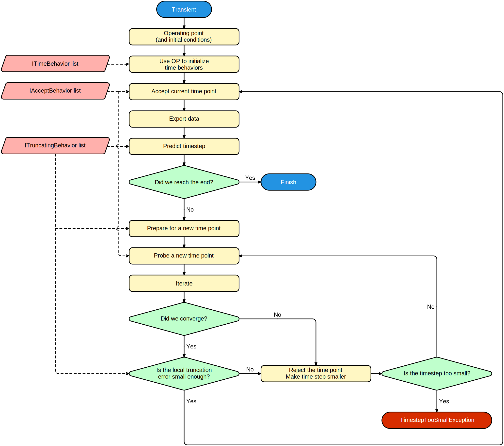

# Transient analysis

A transient analysis a pretty complex type of simulation that tries to model all effects in time. It does so by *discretizing* the timepoints. Like many other simulations, it starts out by calculating the operating point, possibly including **initial conditions**. It then keeps trying to advance in time by calculating the solution at incremental timesteps.

## Timestep control

Time-dependent calculations often involve integrating or differentiating quantities. This is handled by an **[IIntegrationMethod](xref:SpiceSharp.Simulations.IIntegrationMethod)**. The integration method can also control the timestep for a number of reasons:

- The local truncation error (error made by using discrete timepoints) might become too large if the timestep is not controlled.
- A solution cannot be found (**[iterating](iterate)** doesn't converge to a solution).

## Frequently encountered issues

| Symptom | Possibly due to ... |
|:--------|:--------------------|
| Throws **[TimestepTooSmallException](xref:SpiceSharp.TimestepTooSmallException)** | The circuit is unable to converge or the solution is varying too abruptly at some timepoint. Check for any harshly nonlinear components and try avoiding these situations. Switching elements are known to lead to quite hard problems. |