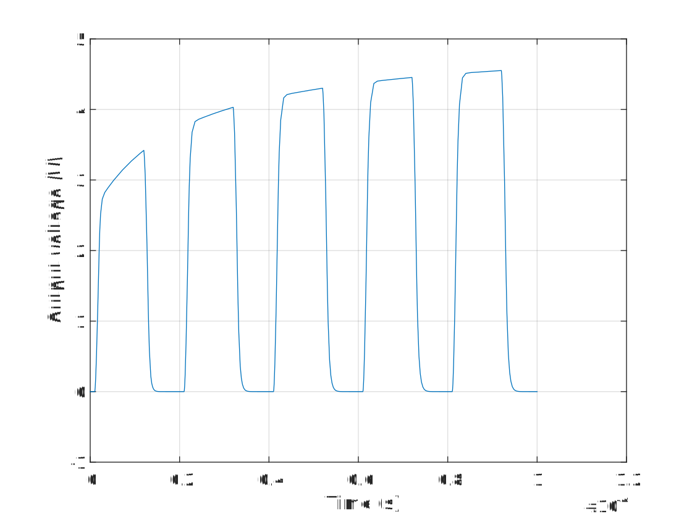

# Example

In this section we will take a look at one way of changing a parameter *during* a transient simulation. For this, we'll use the following circuit.

<p align="center"></p>

[!code-csharp[Circuit](../../../SpiceSharpTest/Examples/ChangingParameter/Changing.cs#example_change_parameter_circuit)]

We also create our transient simulation as we normally would.

[!code-csharp[Circuit](../../../SpiceSharpTest/Examples/ChangingParameter/Changing.cs#example_change_parameter_transient)]

So far so good. Nothing has really changed from before. We will now subscribe to the necessary events to modify the value of *R2*. We want it to change linearly with time from \(1k\Omega\) to \(11k\Omega\).

## The biasing behavior of a resistor

The resistance of a resistor can be changed using the **[Parameters](xref:SpiceSharp.Components.Resistors.Parameters)** of that resistor. But we cannot change the parameters directly from the entity! In other words, the following will fail to change the resistance for the simulation.

```csharp
ckt["R1"].SetParameter(newResistance);
```

This is because the entity is only in charge of creating behaviors for the simulation. After these behaviors are created, the entity has no say anymore in what happens.

The reason why it won't work, is that the resistor's **[Temperature](xref:SpiceSharp.Components.Resistors.Temperature)** behavior will derive a conductance property that is used by the biasing behavior. So to have any effect, we:
1. change the resistance property in the **[Parameters](xref:SpiceSharp.Components.Resistors.Parameters)**.
2. call the *Temperature* method of the **[Temperature](xref:SpiceSharp.Components.Resistors.Temperature)** behavior.

If you need to do something similar to other components, it is recommended to take a look at the source code to find out where the parameter is being used.

### Requesting the necessary parameters and behaviors

Parameters can potentially be cloned to make them independent of behaviors running in other simulations, so we prefer to ask our simulation for the parameters instead of the original entity. All behaviors will be created during setup, so we can use the `AfterSetup` code to retrieve our parameters.

[!code-csharp[Extract parameters and behaviors](../../../SpiceSharpTest/Examples/ChangingParameter/Changing.cs#example_change_parameter_setup)]

### Updating the parameters

We need to update the resistance every time the simulation is getting ready to load the Y-matrix and RHS-vector. In other words, by registering to the **[BeforeLoad](xref:SpiceSharp.Simulations.BiasingSimulation#SpiceSharp_Simulations_BiasingSimulation_BeforeLoad)** event, we can be sure that the resistance is always updated with the latest value.

> **Note**
>
> The `BeforeLoad` and `AfterLoad` events are used instead of yielding a code to the `foreach` loop because of performance reasons. These events are called in very tight loops.

[!code-csharp[Change parameter](../../../SpiceSharpTest/Examples/ChangingParameter/Changing.cs#example_change_parameter_load)]

Combining all these code snippets finally results in the following simulation output.

<p align="center"></p>
