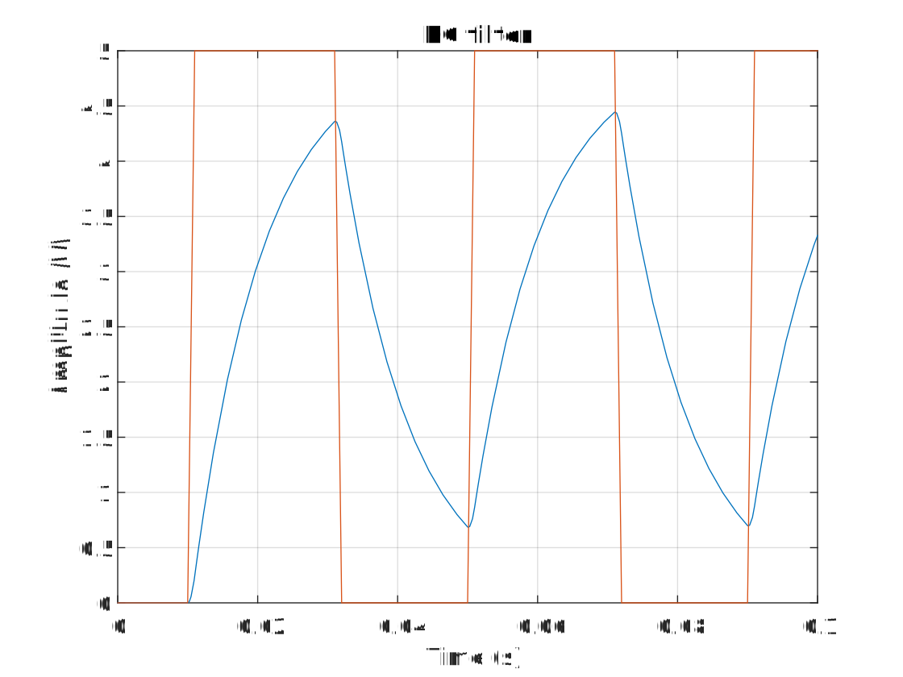

# Transient analysis

A transient analysis will attempt to include as many effects possible. The unfortunate consequence is that this type of simulation is also by far the slowest. Luckily, it is relatively straightforward to use.

Let's use our low-pass RC filter from before and apply a *pulsed* voltage source.

<p align="center"></p>

[!code-csharp[Circuit](../../SpiceSharpTest/BasicExampleTests.cs#example_Transient)]

The voltage source now is passed a **[Pulse](xref:SpiceSharp.Components.Pulse)** object that will calculate the voltage in time for us.

The **[Transient](xref:SpiceSharp.Simulations.Transient)** simulation expects a *timestep* that will be used to calculate the initial timestep for the simulation, and a *final time* that tells the analysis the last time point to simulate.

The resulting waveforms look as follows:

<p align="center"></p>

Note that Spice 3f5 will simulate the same thing if you feed it the following netlist.

```
Transient example

V1 in 0 PULSE(0 5 10m 1m 1m 20m 40m)
R1 in out 10k
C1 out 0 1u

.TRAN 1m 0.1

* Export voltages/currents/etc.

.END
```
